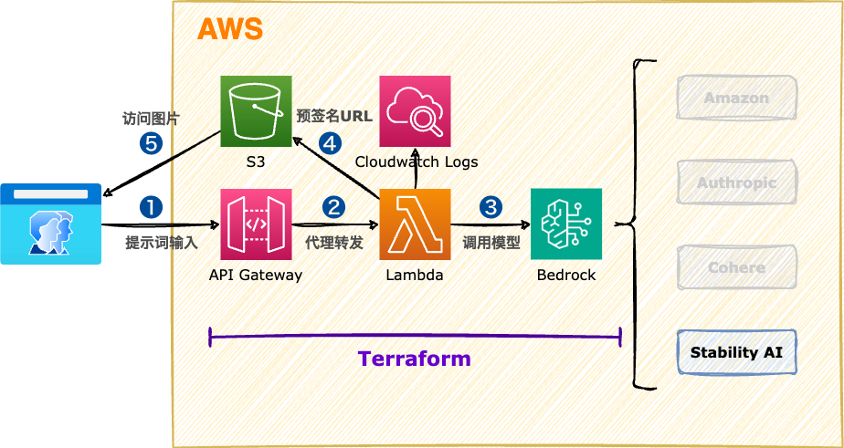

<style scoped>
  section {
    align-items: center;
    justify-content: center;
  }
  h1 {
    color: #8be9fd;
    font-size: 100px;
  }
  img {
    border-radius: 50% 20% / 10% 40%;
  }
</style>


# Amazon Bedrock

---
<style scoped>
  section {
    font-size: 32px;
  }
  h1 {
    font-size: 50px;
    color: #f8f8f2;
  }
  li {
    font-family: Menlo;
    font-size: 32px;
  }
  a {
    font-size: 26px;
  }
  img {
    border-radius: 20%;
    shadow: 0 5px 10px rgba(0,0,0,.4);
    margin: 0;
  }
</style>

# :books: 使用 Stability AI SDXL 生成图片

 Stability AI Developer Platform

Stability AI是一家致力于推动生成式人工智能（Generative AI）发展的公司，成立于2020年，总部位于英国伦敦。其目标是通过开发和推广各种AI技术，特别是在图像、文本生成方面的技术，来推动人工智能领域的进步。

## 文档

https://platform.stability.ai/docs/api-reference#tag/SDXL-and-SD1.6/operation/textToImage

---
<style scoped>
  h1 {
    font-size: 64px;
    color: #f8f8f2;
    margin: 0;
  }
  section {
    align-items: center;
    justify-content: center;
  }
  img {
    border-radius: 2%;
    margin: 0;
  }
</style>

# 系统架构



---
<style scoped>
  section {
    align-items: center;
    justify-content: center;
  }
  h1 {
    color: #f8f8f2;
    font-size: 200px;
    margin: 0;
  }
  img {
    border-radius: 20%;
    margin: 0;
  }
</style>


# 操作演示

---
<style scoped>
  h3 {
    margin-top: 0;
  }
</style>
## 课堂实验

### Lambda函数

```py
import json
import boto3
import base64
import datetime
import random

s3Bucket = "komadevops-s3"

t_delta = datetime.timedelta(hours=9)
JST = datetime.timezone(t_delta, 'JST')

def main(event, context):
    response_body = "No Body"
    client_body = event["body"]
    http_method = event["httpMethod"]
    if client_body and http_method:
      if http_method == "POST":
        response_body = generateImageBySDML(client_body)
    return {
        'statusCode': 200,
        'body': response_body,
        'headers': {"Content-Type": "text/plain"},
    }
# 生成图片
def generateImageBySDML(client_body):
    client_bedrock = boto3.client('bedrock-runtime')
    client_s3 = boto3.client('s3')

    input_prompt = client_body #"Japanese modern female heroine"
    seed = random.randint(0, 4294967295)
    
    # https://platform.stability.ai/docs/api-reference#tag/SDXL-and-SD1.6/operation/textToImage
    response_bedrock = client_bedrock.invoke_model(
        contentType='application/json', 
        accept='application/json',
        modelId='stability.stable-diffusion-xl-v1',
        body=json.dumps(
            {
                "text_prompts": [{"text": input_prompt}],
                "cfg_scale": 20,
                "samples": 1,
                "steps": 30,
                "seed": seed,
                "height": 768,
                "width": 1344,
                # 3d-model, analog-film, anime, cinematic, comic-book, digital-art, enhance, fantasy-art, isometric, line-art, low-poly, modeling-compound, neon-punk, origami, photographic, pixel-art, tile-texture
                "style_preset": "photographic",
            })
        )
    
    response_bedrock_byte=json.loads(response_bedrock['body'].read())
    response_bedrock_base64 = response_bedrock_byte['artifacts'][0]['base64']
    response_bedrock_finalimage = base64.b64decode(response_bedrock_base64)

    now = datetime.datetime.now(JST)
    imageName = 'imageName_'+ now.strftime('%Y%m%d%H%M%S') + ".png"
    response_s3=client_s3.put_object(
        Bucket=s3Bucket,
        Body=response_bedrock_finalimage,
        Key=imageName)

    # 生成S3预签名URL
    generate_presigned_url = client_s3.generate_presigned_url('get_object', Params={
      'Bucket': s3Bucket,
      'Key': imageName,
      'ResponseCacheControl': 'no-cache',
      'ResponseContentDisposition': 'inline',
      'ResponseContentType': 'image/png',
    }, ExpiresIn=3600)
    print(generate_presigned_url)

    return generate_presigned_url
```

---
### 执行脚本

```bash
# Terraform工程
cd terraform_main
# 修改 aws provider 配置
nano 00-main.tf
# 修改 aws region 配置(@弗吉尼亚区)
nano 01-variables.tf

# 更新Lambda函数代码
nano lambdas/my_lambda/index.py

# 部署Lambda函数
terraform init
terraform apply

# 测试Lambda函数
curl -X POST -d "Japanese modern female heroine" \
    https://xxx.execute-api.us-east-1.amazonaws.com/dev/lambda
curl -O https://YOUR_BUCKET.s3.amazonaws.com/YOUR_KEY

# 删除云资源
terraform destroy
```

---
<style scoped>
  section {
    align-items: center;
    justify-content: center;
  }
  h1 {
    color: #f8f8f2;
    font-size: 200px;
  }
</style>

# 下课时间

