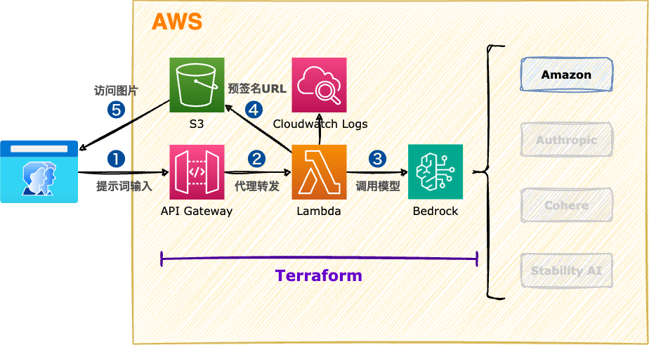

<style scoped>
  section {
    align-items: center;
    justify-content: center;
  }
  h1 {
    color: #8be9fd;
    font-size: 100px;
  }
  img {
    border-radius: 50% 20% / 10% 40%;
  }
</style>


# Amazon Bedrock

---
<style scoped>
  section {
    font-size: 26px;
  }
  h1 {
    font-size: 50px;
    color: #f8f8f2;
  }
  li {
    font-family: Menlo;
    font-size: 32px;
  }
  a {
    font-size: 26px;
  }
  img {
    border-radius: 20%;
    shadow: 0 5px 10px rgba(0,0,0,.4);
    margin: 0;
  }
</style>

# :books: 使用 Amazon Titan 模型生成图片

Amazon Bedrock 独有的 Amazon Titan 系列模型融合了 Amazon 25 年来，在其业务范围内积累的人工智能和机器学习创新的经验。Amazon Titan 基础模型通过完全托管的 API 为客户提供广泛的高性能图像、多模式和文本模型选择。Amazon Titan 模型由 AWS 创建并在大型数据集上进行预训练，使其成为强大的通用模型，旨在支持各种用例，同时还支持负责任地使用 AI。您可以按原样使用，也可以根据自己的数据私下进行自定义。

## 文档

https://aws.amazon.com/cn/bedrock/titan/
https://docs.aws.amazon.com/bedrock/latest/userguide/model-parameters-titan-image.html

---
<style scoped>
  h1 {
    font-size: 64px;
    color: #f8f8f2;
    margin: 0;
  }
  section {
    align-items: center;
    justify-content: center;
  }
  img {
    border-radius: 2%;
    margin: 0;
  }
</style>

# 系统架构



---
<style scoped>
  section {
    align-items: center;
    justify-content: center;
  }
  h1 {
    color: #f8f8f2;
    font-size: 200px;
    margin: 0;
  }
  img {
    border-radius: 20%;
    margin: 0;
  }
</style>


# 操作演示

---
<style scoped>
  h3 {
    margin-top: 0;
  }
</style>
## 课堂实验

### Lambda函数

```py
import json
import boto3
import base64
import datetime
import random

s3Bucket = "komadevops-s3"

t_delta = datetime.timedelta(hours=9)
JST = datetime.timezone(t_delta, 'JST')

def main(event, context):
    response_body = "No Body"    
    client_body = event["body"]
    http_method = event["httpMethod"]
    if client_body and http_method:
      if http_method == "POST":
        response_body = generateImageByTitan(client_body)
    return {
        'statusCode': 200,
        'body': response_body,
        'headers': {"Content-Type": "text/plain"},
    }
# 生成图片
def generateImageByTitan(client_prompt):
    client_bedrock = boto3.client('bedrock-runtime')
    client_s3 = boto3.client('s3')

    seed = random.randint(0, 4294967295)

    # https://docs.aws.amazon.com/bedrock/latest/userguide/model-parameters-titan-image.html
    body = json.dumps({
        "taskType": "TEXT_IMAGE",
        "textToImageParams": {
            "text": f"""{client_prompt}""",
        },
        "imageGenerationConfig": {
            "numberOfImages": 1,
            "height": 1024,
            "width": 1024,
            "cfgScale": 8.0,
            "seed": seed
        }
    })
    
    response = client_bedrock.invoke_model(
        body=body,
        modelId="amazon.titan-image-generator-v1",
        accept="application/json",
        contentType="application/json",
    )
    response_body = json.loads(response.get("body").read())

    base64_image = response_body.get("images")[0]
    base64_bytes = base64_image.encode('ascii')
    image_bytes = base64.b64decode(base64_bytes)

    finish_reason = response_body.get("error")
    if finish_reason is not None:
        raise ImageError(f"Image generation error. Error is {finish_reason}")

    now = datetime.datetime.now(JST)
    imageName = 'imageName_'+ now.strftime('%Y%m%d%H%M%S') + ".png"
    response_s3=client_s3.put_object(
        Bucket=s3Bucket,
        Body=image_bytes,
        Key=imageName)

    # 生成S3预签名URL
    generate_presigned_url = client_s3.generate_presigned_url('get_object', Params={
      'Bucket': s3Bucket,
      'Key': imageName,
      'ResponseCacheControl': 'no-cache',
      'ResponseContentDisposition': 'inline',
      'ResponseContentType': 'image/png',
    }, ExpiresIn=3600)
    print(generate_presigned_url)

    return generate_presigned_url
```

---
### 执行脚本

```bash
# Terraform工程
cd terraform_main
# 修改 aws provider 配置
nano 00-main.tf
# 修改 aws region 配置(@弗吉尼亚区)
nano 01-variables.tf

# 更新Lambda函数代码
nano lambdas/my_lambda/index.py

# 部署Lambda函数
terraform init
terraform apply

# 测试Lambda函数
curl -X POST -d "two monkeys in the tree" \
    https://xxx.execute-api.us-east-1.amazonaws.com/dev/lambda
curl -O https://YOUR_BUCKET.s3.amazonaws.com/YOUR_KEY

# 删除云资源
terraform destroy
```

---
<style scoped>
  section {
    align-items: center;
    justify-content: center;
  }
  h1 {
    color: #f8f8f2;
    font-size: 200px;
  }
</style>

# 下课时间

