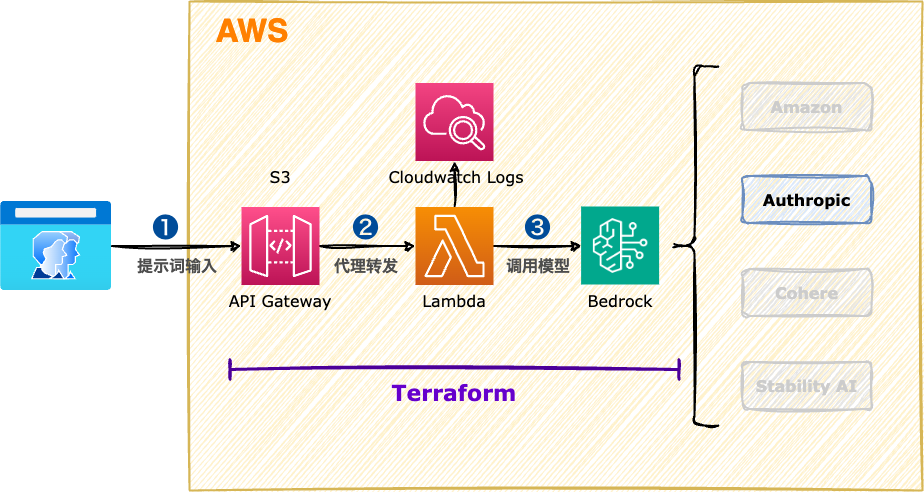

<style scoped>
  section {
    align-items: center;
    justify-content: center;
  }
  h1 {
    color: #8be9fd;
    font-size: 100px;
  }
  img {
    border-radius: 50% 20% / 10% 40%;
  }
</style>


# Amazon Bedrock

---
<style scoped>
  section {
    font-size: 40px;
  }
  h1 {
    font-size: 50px;
    color: #f8f8f2;
  }
  li {
    font-family: Menlo;
    font-size: 32px;
  }
</style>

# :books: 使用文本生成API - Claude(Bedrock)

Claude 是 Anthropic 打造的一款高性能、值得信赖且智能的 AI 平台。Claude 擅长处理语言、推理、分析、编码等任务。

### 官网
https://www.anthropic.com/

### 文档
https://docs.anthropic.com/en/api/complete

---
<style scoped>
  h1 {
    font-size: 64px;
    color: #f8f8f2;
    margin: 0;
  }
  section {
    align-items: center;
    justify-content: center;
  }
  img {
    border-radius: 2%;
    margin: 0;
  }
</style>

# 系统架构



---
<style scoped>
  section {
    align-items: center;
    justify-content: center;
  }
  h1 {
    color: #f8f8f2;
    font-size: 200px;
    margin: 0;
  }
  img {
    border-radius: 20%;
    margin: 0;
  }
</style>


# 操作演示


---
<style scoped>
  h3 {
    margin-top: 0;
  }
</style>
### 执行脚本

```bash
# Terraform工程
cd terraform_main
# 修改 aws provider 配置
nano 00-main.tf
# 修改 aws region 配置(@弗吉尼亚区)
nano 01-variables.tf

# 更新Lambda函数代码
nano lambdas/my_lambda/index.py

# 部署Lambda函数
terraform init
terraform apply

# 测试Lambda函数
# - 我想去美国旅游，帮我推荐一些有趣的地方吧。
# - 我想到日本吃美食，有什么可以吃的吗？
curl -X POST -d "我想去澳洲留学，给我一些建议好吗？" \
    https://xxx.execute-api.us-east-1.amazonaws.com/dev/lambda

# 删除云资源
terraform destroy
```

---
<style scoped>
  h3 {
    margin-top: 0;
  }
</style>
### Lambda函数

```python
import json
import boto3
import time

client_bedrock = boto3.client("bedrock-runtime")


def main(event, context):

    start_time = time.time()  # 获取开始时间

    result = "No Body"
    http_method = event["httpMethod"]
    client_body = event["body"]
    if client_body and http_method and http_method == "POST":
        result = generateTextCompletion(client_body)
    else:
        result = "No body({})".format(http_method)

    end_time = time.time()  # 获取结束时间
    execution_time = "(程序运行时间：%.2f 秒)" % (end_time - start_time)  # 计算程序运行时间
    print(execution_time)

    return {
        "statusCode": 200,
        "body": "{}\n\n{}".format(execution_time, result),
        "headers": {"Content-Type": "text/plain"},
    }


def generateTextCompletion(client_prompt):

    prompt = """
Human: {}
Assistant:
""".format(
        client_prompt
    )
    print(prompt)

    # https://docs.aws.amazon.com/bedrock/latest/userguide/model-parameters-anthropic-claude-text-completion.html
    body = {
        # 客户端提示词
        "prompt": prompt,
        # 注入响应的随机性量。【0-1:越小越严谨，越大越随机，默认是1】
        "temperature": 0.5,
        # 生成词汇的多样性。【0-1:越小生成的文本质量较高，但多样性会降低；越大生成的文本更具多样性，但质量可能会有所下降。默认是1】
        "top_p": 0.5,
        # 生成的词汇量。【0-500:值越小，生成的文本更可能包含高概率的词，质量更高，但多样性会降低；值越大，考虑的词越多，生成的文本更具多样性，但可能会包含一些低概率的词。默认是250】
        "top_k": 250,
        # 停止前生成的最大令牌数。建议将令牌数限制为4,000，以获得最佳性能。
        "max_tokens_to_sample": 4000,
    }

    response = client_bedrock.invoke_model(
        contentType="application/json",
        accept="application/json",
        modelId="anthropic.claude-v2:1",
        body=json.dumps(body),
    )
    response_body = json.loads(response.get("body").read())

    return response_body.get("completion")
```

---
<style scoped>
  section {
    align-items: center;
    justify-content: center;
  }
  h1 {
    color: #f8f8f2;
    font-size: 200px;
  }
</style>

# 下课时间

