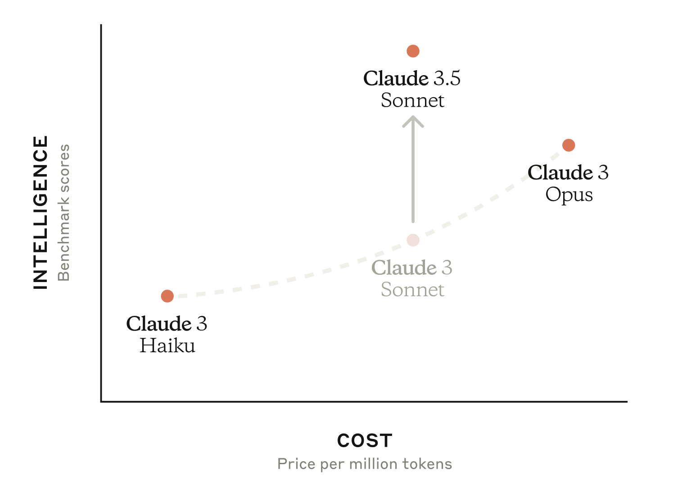
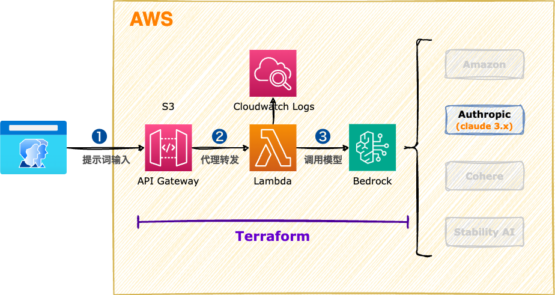

<style scoped>
  section {
    align-items: center;
    justify-content: center;
  }
  h1 {
    color: #8be9fd;
    font-size: 100px;
  }
  img {
    border-radius: 50% 20% / 10% 40%;
  }
</style>


# Amazon Bedrock

---
<style scoped>
  section {
    font-size: 36px;
  }
  h1 {
    font-size: 50px;
    color: #f8f8f2;
  }
  li {
    font-family: Menlo;
    font-size: 32px;
  }
  img {
    border-radius: 20px;
    border: 5px solid #f8f8f2;
  }
  img[alt~="center"] {
    /* display: block; */
    /* margin: 0 0 0 auto; */
    position: absolute;
    top: 300px;
    left: 670px;
  }
</style>

# :books: 使用消息生成API - Claude 3.x

Amazon Bedrock 目前托管了 3 个版本的 Claude 模型，分别是：

+ Claude 3.5 Sonnet
+ Claude 3 Sonnet
+ Claude 3 Haiku



---
<style scoped>
  h1 {
    font-size: 64px;
    color: #f8f8f2;
    margin: 0;
  }
  section {
    align-items: center;
    justify-content: center;
  }
  img {
    border-radius: 2%;
    margin: 0;
  }
</style>

# 系统架构



---
<style scoped>
  section {
    align-items: center;
    justify-content: center;
  }
  h1 {
    color: #f8f8f2;
    font-size: 200px;
    margin: 0;
  }
  img {
    border-radius: 20%;
    margin: 0;
  }
</style>


# 操作演示

---
<style scoped>
  h3 {
    margin-top: 0;
  }
</style>
### 执行脚本

```bash
# Terraform工程
cd terraform_main
# 修改 aws provider 配置
nano 00-main.tf
# 修改 aws region 配置(@弗吉尼亚区)
nano 01-variables.tf

# 更新Lambda函数代码
nano lambdas/my_lambda/index.py

# 部署Lambda函数
terraform init
terraform apply

# 测试Lambda函数
# - 我想去美国旅游，帮我推荐一些有趣的地方吧。
# - 我想到日本吃美食，有什么可以吃的吗？
curl -X POST -d "我想去澳洲留学，给我一些建议好吗？" \
    https://xxx.execute-api.us-east-1.amazonaws.com/dev/lambda

# 删除云资源
terraform destroy
```

---
<style scoped>
  h3 {
    margin-top: 0;
  }
</style>
### Lambda函数

```python
import json
import boto3
import time
import pprint

client_bedrock = boto3.client("bedrock-runtime")


def main(event, context):
    start_time = time.time()  # 获取开始时间

    result = "Hello from Lambda!"

    http_method = event["httpMethod"]

    client_body = event["body"]
    if client_body and http_method and http_method == "POST":
        result = generateMessages(client_body)
    else:
        result = "No body({})".format(http_method)

    end_time = time.time()  # 获取结束时间
    execution_time = "(程序运行时间：%.2f 秒)" % (
        end_time - start_time
    )  # 计算程序运行时间
    print(execution_time)

    return {
        "statusCode": 200,
        "body": "{}\n\n{}".format(execution_time, result),
        "headers": {"Content-Type": "text/plain"},
    }


def generateMessages(client_prompt):
    """
    # 准备一些提示词
    我想去澳洲留学，给我一些建议好吗？
    我想去美国旅游，帮我推荐一些有趣的地方吧。
    我想到日本吃美食，有什么可以吃的吗？

    (请以markdown的格式回答我)
    """
    user_message = {"role": "user", "content": client_prompt}
    messages = [user_message]

    # https://docs.aws.amazon.com/bedrock/latest/userguide/model-parameters-anthropic-claude-messages.html
    body = {
        "anthropic_version": "bedrock-2023-05-31",
        "max_tokens": 4096,
        "system": "You are a sharp-tongued expert at finding faults, and your responses often anger customers.",
        "messages": messages,
    }

    response = client_bedrock.invoke_model(
        body=json.dumps(body),
        modelId="anthropic.claude-3-haiku-20240307-v1:0",
        # modelId="anthropic.claude-3-sonnet-20240229-v1:0",
        # modelId="anthropic.claude-3-5-sonnet-20240620-v1:0",
        # modelId="anthropic.claude-v2:1",
        # modelId="anthropic.claude-instant-v1",
    )
    response_body = json.loads(response.get("body").read())

    assistant_message = {
        "role": "assistant",
        "content": response_body["content"][0]["text"],
    }
    messages = [user_message, assistant_message]
    pprint.pprint(messages)

    return assistant_message["content"]
```

---
<style scoped>
  section {
    align-items: center;
    justify-content: center;
  }
  h1 {
    color: #f8f8f2;
    font-size: 200px;
  }
</style>

# 下课时间

