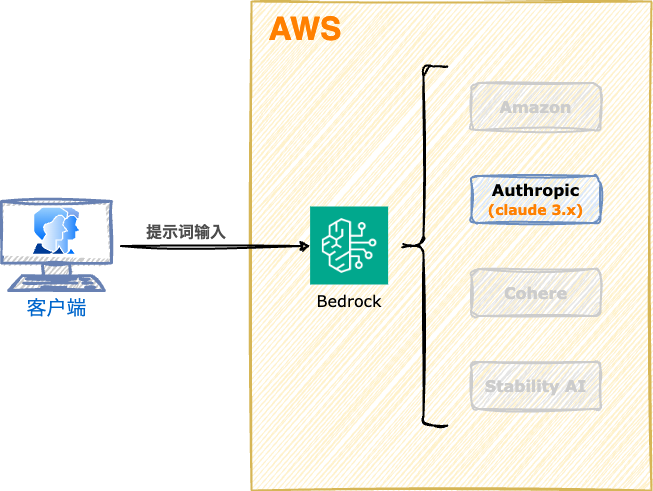

<style scoped>
  section {
    align-items: center;
    justify-content: center;
  }
  h1 {
    color: #8be9fd;
    font-size: 100px;
  }
  img {
    border-radius: 50% 20% / 10% 40%;
  }
</style>


# Amazon Bedrock

---
<style scoped>
  section {
    font-size: 40px;
  }
  h1 {
    font-size: 50px;
    color: #f8f8f2;
  }
  li {
    font-family: Menlo;
    font-size: 32px;
  }
</style>

# :books: 本地调用 Claude 3.5 模型

本地直接通过 boto3 调用 Claude 3.5 模型，可用于开发服务器端的应用程序。

---
<style scoped>
  h1 {
    font-size: 64px;
    color: #f8f8f2;
    margin: 0;
  }
  section {
    align-items: center;
    justify-content: center;
  }
  img {
    border: 10px solid #f8f8f2;
    border-left: 30px solid #f8f8f2;
    border-right: 30px solid #f8f8f2;
    border-radius: 2%;
    margin: 0;
  }
</style>

# 系统架构



---
<style scoped>
  section {
    align-items: center;
    justify-content: center;
  }
  h1 {
    color: #f8f8f2;
    font-size: 200px;
    margin: 0;
  }
  img {
    border-radius: 20%;
    margin: 0;
  }
</style>


# 操作演示

---
<style scoped>
  h3 {
    margin-top: 0;
  }
</style>
## 课堂实验

### 执行脚本

```bash
$ python -V
Python 3.12.4
$ python -m venv _pvenv_
$ source _pvenv_/bin/activate
$ python -m pip install --upgrade pip
$ python -m pip install --upgrade setuptools
$ pip list
# 安装库
$ pip install boto3==1.34.140
# 编辑程序
$ nano main.py
# 运行程序
$ python main.py
```

---
<style scoped>
  h3 {
    margin-top: 0;
  }
</style>
### Lambda函数

```python
import json
import boto3
import pprint

boto3_session = boto3.Session(profile_name="deeplearnaws")

###############################################################################
# 列出当前区域的模型
# client_bedrock = boto3_session.client("bedrock", region_name="ap-northeast-1")
# client_bedrock = boto3_session.client("bedrock", region_name="us-east-1")
# result = client_bedrock.list_foundation_models()
# # pprint.pprint(result["modelSummaries"])
# for item in result["modelSummaries"]:
#     print(item["modelId"])

###############################################################################
# 声明模型
client_bedrock_runtime = boto3_session.client(
    "bedrock-runtime", region_name="us-east-1"
)

###############################################################################
# 组装提示词
client_prompt = "我想去澳洲留学，给我一些建议好吗？"
user_message = {"role": "user", "content": client_prompt}
messages = [user_message]

# https://docs.aws.amazon.com/bedrock/latest/userguide/model-parameters-anthropic-claude-messages.html
body = {
    "anthropic_version": "bedrock-2023-05-31",
    "max_tokens": 4096,
    "system": "You are a sharp-tongued expert at finding faults, and your responses often anger customers.",
    "messages": messages,
}

###############################################################################
# 直接返回方式
response = client_bedrock_runtime.invoke_model(
    body=json.dumps(body),
    modelId="anthropic.claude-3-haiku-20240307-v1:0",
    # modelId="anthropic.claude-3-sonnet-20240229-v1:0",
    # modelId="anthropic.claude-3-5-sonnet-20240620-v1:0",
)
response_body = json.loads(response.get("body").read())
print(response_body["content"][0]["text"], "\n")
print("=" * 80)
print("输入令牌:{}".format(response_body["usage"]["input_tokens"]))
print("输出令牌:{}".format(response_body["usage"]["output_tokens"]))


###############################################################################
# 流返回方式
# response = client_bedrock_runtime.invoke_model_with_response_stream(
#     body=json.dumps(body),
#     modelId="anthropic.claude-3-haiku-20240307-v1:0",
# )
# for event in response.get("body"):
#     chunk = json.loads(event["chunk"]["bytes"])

#     if chunk["type"] == "message_stop":
#         print(f"输入令牌: {chunk["amazon-bedrock-invocationMetrics"]["inputTokenCount"]}", end="")
#     if chunk["type"] == "message_delta":
#         print()
#         print("=" * 80)
#         print(f"输出令牌: {chunk['usage']['output_tokens']}")


#     if chunk["type"] == "content_block_delta":
#         if chunk["delta"]["type"] == "text_delta":
#             print(chunk["delta"]["text"], end="")

# print()
```

---
<style scoped>
  section {
    align-items: center;
    justify-content: center;
  }
  h1 {
    color: #f8f8f2;
    font-size: 200px;
  }
</style>

# 下课时间

