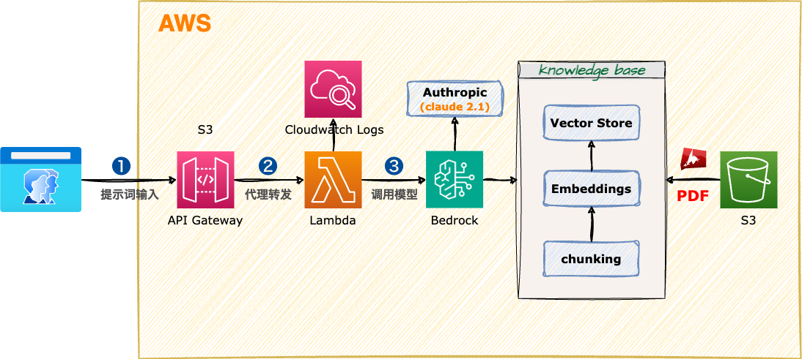

<style scoped>
  section {
    align-items: center;
    justify-content: center;
  }
  h1 {
    color: #8be9fd;
    font-size: 100px;
  }
  img {
    border-radius: 50% 20% / 10% 40%;
  }
</style>


# Amazon Bedrock

---
<style scoped>
  section {
    font-size: 40px;
  }
  h1 {
    font-size: 50px;
    color: #f8f8f2;
  }
  li {
    font-family: Menlo;
    font-size: 32px;
  }
  img {
    border-radius: 3%;
    border: 7px solid #f8f8f2;
    position: absolute;
    right: 50px;
    bottom: 50px;
  }
</style>

# :books: 使用 Bedrock 知识库 - knowledge base

使用 Amazon Bedrock 知识库，快速搭建托管的 RAG(Retrieval Augmented Generation) 检索增强生成系统。

### (小马继续批三国)


---
<style scoped>
  h1 {
    font-size: 64px;
    color: #f8f8f2;
    margin: 0;
  }
  section {
    align-items: center;
    justify-content: center;
  }
  img {
    border-radius: 2%;
    margin: 0;
  }
</style>

# RAG 系统架构



---
<style scoped>
  section {
    align-items: center;
    justify-content: center;
  }
  h1 {
    color: #f8f8f2;
    font-size: 200px;
    margin: 0;
  }
  img {
    border: 10px solid #f8f8f2;
    border-radius: 20%;
    margin: 0;
  }
</style>


# 操作演示

---
<style scoped>
  h3 {
    margin-top: 0;
  }
</style>
## 课堂实验

### 提示词

```
请问桃园结义是几个人？都是谁？

虎牢关谁打败了吕布？

小马三顾茅庐请出的人是谁？
```

---
<style scoped>
  section {
    align-items: center;
    justify-content: center;
  }
  h1 {
    color: #f8f8f2;
    font-size: 200px;
  }
</style>

# 下课时间

