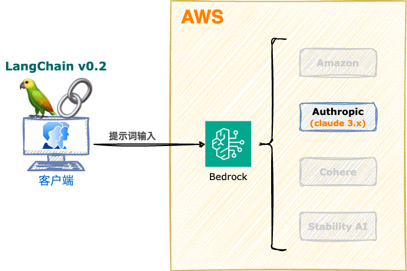

<style scoped>
  section {
    align-items: center;
    justify-content: center;
  }
  h1 {
    color: #8be9fd;
    font-size: 100px;
  }
  img {
    border-radius: 50% 20% / 10% 40%;
  }
</style>


# Amazon Bedrock

---
<style scoped>
  section {
    font-size: 40px;
  }
  h1 {
    font-size: 50px;
    color: #f8f8f2;
  }
  h2 {
    font-size: 40px;
    color: #f8f8f2;
  }
  li {
    font-family: Menlo;
    font-size: 32px;
    margin: 0;
  }
</style>

# :books: 引用 LangChain 开发框架

使用 LangChain 框架开发 Bedrock 应用，可以更加方便地开发和部署 AI 应用。

## 官网
https://www.langchain.com/

## 文档
https://python.langchain.com/v0.2/docs/introduction/

---
<style scoped>
  h1 {
    font-size: 64px;
    color: #f8f8f2;
    margin: 0;
  }
  section {
    align-items: center;
    justify-content: center;
  }
  img {
    border: 10px solid #f8f8f2;
    border-radius: 2%;
    margin: 0;
  }
</style>

# 系统架构



---
<style scoped>
  section {
    align-items: center;
    justify-content: center;
  }
  h1 {
    color: #f8f8f2;
    font-size: 200px;
    margin: 0;
  }
  img {
    border: 10px solid #f8f8f2;
    border-radius: 20%;
    margin: 0;
  }
</style>


# 操作演示

---
<style scoped>
  h3 {
    margin-top: 0;
  }
</style>
## 课堂实验

### 执行脚本

```bash
$ python -V
Python 3.12.4
$ python -m venv _pvenv_
$ source _pvenv_/bin/activate
$ python -m pip install --upgrade pip
$ python -m pip install --upgrade setuptools
$ pip list
# 安装库
$ pip install \
  langchain==0.2.7 \
  langchain-community==0.2.7 \
  langchain-aws==0.1.11
```

---
<style scoped>
  h3 {
    margin-top: 0;
  }
</style>
### Python

```python
import time
from langchain_aws import ChatBedrock
from langchain_core.messages import AIMessage, HumanMessage, SystemMessage

print("=" * 100)
start_time = time.time()  # 获取开始时间
messages = [
    SystemMessage("你是一语言专辑，精通英语和中文。"),
    HumanMessage("可以帮我翻译一些英文成中文吗？"),
    AIMessage("当然可以！请告诉我你需要翻译的英文内容，我会尽力帮你翻译成中文。"),
    HumanMessage("book"),
]
model = ChatBedrock(
    credentials_profile_name="deeplearnaws",
    region_name="us-east-1",
    model_id="anthropic.claude-3-haiku-20240307-v1:0",
    model_kwargs={
        "max_tokens": 512,
        "temperature": 0,
        "top_p": 1.0,
    },
)
result = model.invoke(messages)
print(result.content)
print()

evalEndTime = lambda end_time: "(程序运行时间：%.2f 秒)" % (end_time - start_time)

print(evalEndTime(time.time()))
```

---
<style scoped>
  section {
    align-items: center;
    justify-content: center;
  }
  h1 {
    color: #f8f8f2;
    font-size: 200px;
  }
</style>

# 下课时间

