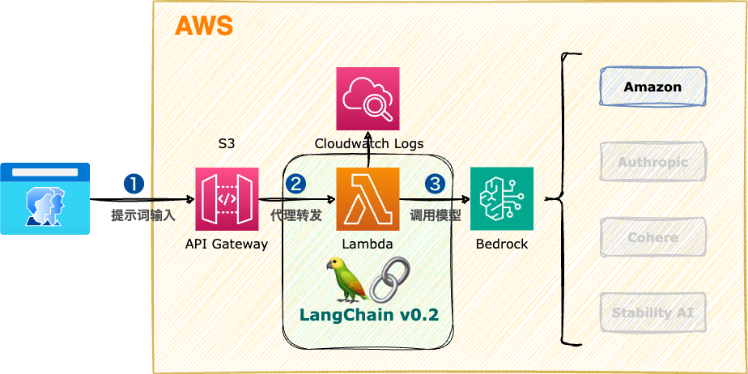

<style scoped>
  section {
    align-items: center;
    justify-content: center;
  }
  h1 {
    color: #8be9fd;
    font-size: 100px;
  }
  img {
    border-radius: 50% 20% / 10% 40%;
  }
</style>


# Amazon Bedrock

---
<style scoped>
  section {
    font-size: 40px;
  }
  h1 {
    font-size: 50px;
    color: #f8f8f2;
  }
  li {
    font-family: Menlo;
    font-size: 32px;
  }
  a {
    font-size: 32px;
  }
</style>

# :books: 在 Lambda 函数中使用 LangChain

在 Lambda 函数中使用 LangChain 框架开发 Bedrock 应用。

### 文档
https://python.langchain.com/v0.2/docs/integrations/platforms/aws/

---
<style scoped>
  h1 {
    font-size: 64px;
    color: #f8f8f2;
    margin: 0;
  }
  section {
    align-items: center;
    justify-content: center;
  }
  img {
    border: 10px solid #f8f8f2;
    border-radius: 2%;
    margin: 0;
  }
</style>

# 系统架构



---
<style scoped>
  section {
    align-items: center;
    justify-content: center;
  }
  h1 {
    color: #f8f8f2;
    font-size: 200px;
    margin: 0;
  }
  img {
    border: 10px solid #f8f8f2;
    border-radius: 20%;
    margin: 0;
  }
</style>


# 操作演示

---
<style scoped>
  h3 {
    margin-top: 0;
  }
</style>
### 执行脚本

```bash
# 拉取 terraform 基础代码
git clone https://github.com/komavideo/terraform_main
cd terraform_main
git checkout apigateway-lambda-python-docker

# 编辑 aws provider 和 region(@弗吉尼亚区)
nano 00-main.tf
nano 01-variables.tf

# 更新Lambda函数代码(推荐在Python虚拟环境中运行)
python -m venv _pvenv_
source _pvenv_/bin/activate
python -m pip install --upgrade pip
python -m pip install --upgrade setuptools
pip list
pip install -r lambdas/my_lambda/requirements.txt
pip install langchain==0.2.7 langchain-community==0.2.7 langchain-aws==0.1.11
pip freeze > lambdas/my_lambda/requirements.txt
nano lambdas/my_lambda/index.py

# 部署代码
terraform init
terraform apply

# 确认部署
curl https://xxx.execute-api.ap-northeast-1.amazonaws.com/dev/lambda

# 删除代码
terraform destroy
```

---
<style scoped>
  h3 {
    margin-top: 0;
  }
</style>
### Lambda函数

```python
import time
from langchain_aws import ChatBedrock
from langchain_core.messages import AIMessage, HumanMessage, SystemMessage


def main(event, context):

    start_time = time.time()  # 获取开始时间

    messages = [
        SystemMessage("你是一语言专辑，精通英语和中文。"),
        HumanMessage("可以帮我翻译一些英文成中文吗？"),
        AIMessage("当然可以！请告诉我你需要翻译的英文内容，我会尽力帮你翻译成中文。"),
        HumanMessage("book"),
    ]

    model = ChatBedrock(
        model_id="anthropic.claude-3-haiku-20240307-v1:0",
        model_kwargs={
            "max_tokens": 512,
            "temperature": 0,
            "top_p": 1.0,
        },
    )

    result = model.invoke(messages)
    print(result.content)

    end_time = time.time()  # 获取结束时间
    execution_time = "(程序运行时间：%.2f 秒)" % (
        end_time - start_time
    )  # 计算程序运行时间
    print(execution_time)

    return {
        "statusCode": 200,
        "body": "{}\n\n{}".format(execution_time, result.content),
        "headers": {"Content-Type": "text/plain"},
    }
```

---
<style scoped>
  section {
    align-items: center;
    justify-content: center;
  }
  h1 {
    color: #f8f8f2;
    font-size: 200px;
  }
</style>

# 下课时间

